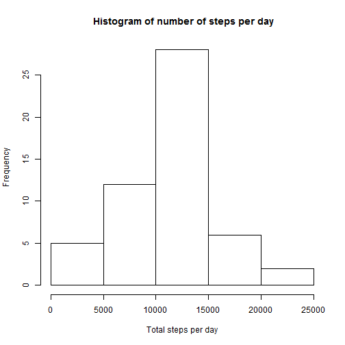
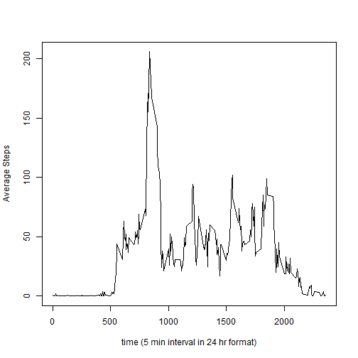
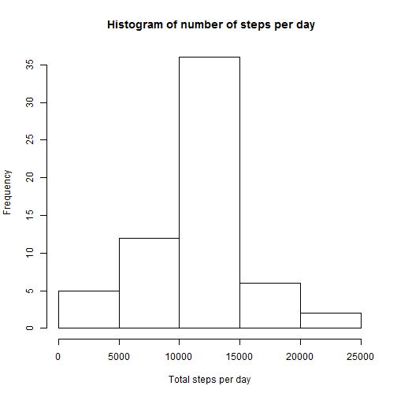
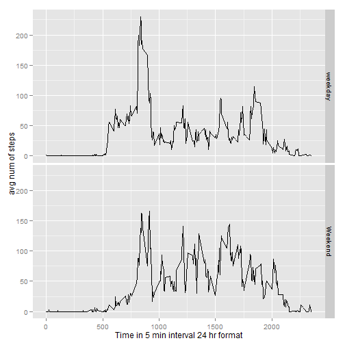

## Loading and preprocessing the data

Download, unzip and extract the csv file
  

```r
temp <- tempfile()
download.file("http://d396qusza40orc.cloudfront.net/repdata%2Fdata%2Factivity.zip",temp)
data <- read.table(unz(temp, "activity.csv"),sep=",", header= T)
unlink(temp)
```
  


## What is mean total number of steps taken per day?


```r
data.nmis <- data[!is.na(data$steps),]
library(dplyr)
library(ggplot2)
library(data.table)
```

```r
datab <- group_by(data.nmis, date)
steps <- summarise(datab, totalsteps = sum(steps))
hist(steps$totalsteps, main=" Histogram of number of steps per day", xlab="Total steps per day")
```

 
  
  
Mean steps 
  
  

```r
trunc(mean(steps$totalsteps))
```

```
## [1] 10766
```
  
  
Median steps


```r
median(steps$totalsteps)
```

```
## [1] 10765
```

## What is the average daily activity pattern?
  
  

```r
datac <- group_by(data.nmis, interval)
timestep <- summarise(datac, avgsteps = trunc(mean(steps)))
plot(timestep$interval, timestep$avgsteps, type="l", xlab="time (5 min interval in 24 hr format)",
     ylab="Average Steps" ) 
```

 
  
  
5-min interval that contaisn the maximum average steps
  
  

```r
timestep[which.max(timestep$avgsteps),]
```

```
## Source: local data frame [1 x 2]
## 
##     interval avgsteps
## 104      835      206
```


## Imputing missing values


Number of missing values(rows)
  
  

```r
sum(is.na(data$steps))
```

```
## [1] 2304
```
  
Impute with mean steps for a given time interval


```r
dt<-as.data.table(data)
dt1<-dt[, steps := ifelse(is.na(steps), as.integer(mean(steps, na.rm = T)), steps), by = interval]
```
  
Calculate sum of steps by day and plot histogram
  

```r
datac <- group_by(dt1, date)
stepimp <- summarise(datac, totalsteps = sum(steps))
hist(stepimp$totalsteps, main=" Histogram of number of steps per day", xlab="Total steps per day")
```

 
  
  Mean number of steps
    
    

```r
trunc(mean(stepimp$totalsteps))
```

```
## [1] 10749
```
  
  Median number of steps
  

```r
median(stepimp$totalsteps)
```

```
## [1] 10641
```
  
## Are there differences in activity patterns between weekdays and weekends?

generate daytype variable and summarize  
  

```r
dt$date<-as.Date(dt$date)
dt$day<-weekdays(dt$date)
dt$daytype <- ifelse(dt$day=="Saturday" | dt$day=="Sunday", "Weekend", "weekday")

columns<-c("daytpe","interval")
d<-dt %.%
        group_by(daytype, interval) %.%
        summarise(avgsteps = trunc(mean(steps)))
```
  
Panel plot  
  

```r
qplot(interval, avgsteps, data=d,
      facets= daytype~., geom="line",
      xlab="Time in 5 min interval 24 hr format", ylab="avg num of steps") 
```

 

On weekends, the number of steps is evenly distributed whereas for weekdays they are concentrated to early morning hours.


